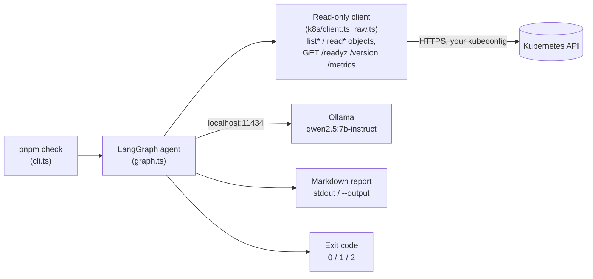
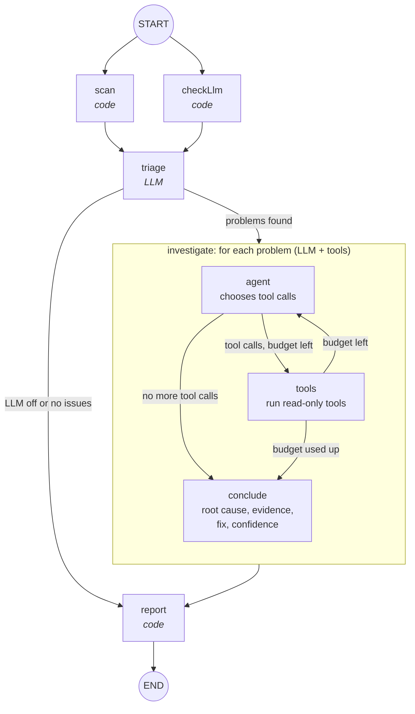

# local-devops-agent

A local AI agent that runs a full, read-only health check on a Kubernetes cluster. On
each run it scans the cluster, decides what to dig into, investigates each problem with
read-only tools, and writes a report: what's wrong, the likely root cause, and a suggested
fix.

Everything runs on your machine. The LLM is served by [Ollama](https://ollama.com), so no
cloud LLM APIs are used, and no cluster data leaves your machine.

```text
$ pnpm demo:check --verbose
[12:51:39] scan: 2 nodes, 18 pods, 7 deployments, 11 warning events, 12 issues
[12:51:46] triage: 5 problem(s) to investigate (6611ms)
...
[12:52:44] investigate [5/5] Validating webhook cronjobs.policy.agent-demo.example.com is unreachable and blocks the requests it matches
[12:52:44]     → k8s_cluster_health {} (662 chars, 115ms)
...
### 5. [CRITICAL] The ValidatingWebhookConfiguration agent-demo-policy is unreachable due to a missing or failed Service agent-test/policy-webhook.
**Root cause:** Service agent-test/policy-webhook has no ready endpoints
```

## Features

- **One command, no questions:** `pnpm check` scans the cluster and prints a report.
- **Finds common failures with rules:** crashlooping, OOMKilled, unschedulable and
  image-pull failures in workloads, Deployments, StatefulSets and DaemonSets without ready
  pods, pods the API server refuses to create (quota, Pod Security, webhooks), Services
  that route to no ready pod, and cluster DNS outages, plus cluster-level risks: failing API server and etcd
  health checks, control-plane components that are down or recently restarted or failing
  probes, etcd nearing its storage quota, expiring API server certificates, stale kubelet
  heartbeats, full nodes, unsupported version skew, and admission webhooks that block
  requests. See [What it checks](#what-it-checks).
- **Investigates like an SRE:** a local LLM groups related issues, then uses read-only
  tools (describe, logs, events, workloads, services) to find the root cause and suggest a fix.
- **Read-only by construction:** write, delete and exec operations are blocked in code,
  not just by prompt instructions (see [Safety](#safety)).
- **Works without the LLM:** if Ollama is down, or with `--no-llm`, you still get the
  rule-based report.
- **Cron/CI friendly:** exits with code `2` when critical issues are found, writes a JSON
  report, and with `--compare` shows what is new, escalated or resolved since the last run.
- **One-command demo:** a kind cluster with deliberately broken workloads to try it on.

## Quickstart (about 5 minutes)

This runs the agent against a throwaway demo cluster, so you can see it work before
pointing it at a real cluster. You need Node.js 20+, Docker and Ollama (see
[Setup](#setup) for installing them).

```bash
pnpm install
```

```bash
ollama pull qwen2.5:7b-instruct
```

```bash
pnpm demo:up
```

```bash
pnpm demo:check --verbose
```

`demo:up` creates a two-node [kind](https://kind.sigs.k8s.io/) cluster, deploys five
broken workloads, one healthy one, two broken Services and a broken admission webhook, and
waits until each has actually failed. The first
run downloads kind and its node image, so it takes a few minutes. `demo:check` runs the
agent and prints the report. Delete the cluster with `pnpm demo:down`.

## Architecture

### Overview



The agent talks to two things: the Kubernetes API, only through a client that cannot
write, and a local Ollama server. Nothing else leaves the machine.

### Agent flow



| Step | Uses the LLM | What it does |
| --- | --- | --- |
| **scan** | no | Lists nodes, pods, workloads, Services, recent warning events, webhooks and control-plane health in parallel, summarizes them, and runs the rules. A failed call is recorded and the scan continues. |
| **checkLlm** | no | Checks that Ollama is reachable and the model is pulled. Runs in parallel with the scan. |
| **triage** | yes | Picks up to `MAX_PROBLEMS` problems and merges issues with one root cause (for example, a Deployment and its crashing pods). |
| **investigate** | yes | For each problem, a tool-calling loop of at most `MAX_STEPS_PER_PROBLEM` calls, then a structured conclusion. |
| **report** | no | Investigated problems first, then the remaining rule-based issues, recent warning events and notes. |

The **scan is plain code**, so it finds the same issues every time. **Severity and the
exit code come only from the rules**, so the LLM can explain a problem but can never hide
one. If the LLM is unavailable, the graph skips straight to the report.

### What it checks

The rules run on every scan, with or without the LLM. Severity decides the exit code.

| Area | Check | Severity |
| --- | --- | --- |
| Control plane | `/readyz` check for etcd failing | critical |
| Control plane | Other API server readiness checks failing | critical |
| Control plane | API server certificate expires within 7 days / 30 days | critical / warning |
| Control plane | Component pod (etcd, kube-apiserver, scheduler, controller-manager) not ready | critical |
| Control plane | Component restarted, or failed 3+ health probes, within `EVENT_WINDOW_MINUTES` | warning |
| etcd | Database at 90% / 70% of its quota (a full etcd makes the cluster read-only) | critical / warning |
| etcd | More than 100,000 objects of one resource | warning |
| Nodes | NotReady | critical |
| Nodes | Kubelet heartbeat (its Lease) not renewed for over 60 seconds | critical |
| Nodes | Kubelet newer than, or more than 3 minor versions behind, the API server | critical |
| Nodes | CPU, memory or pod requests at 90% of allocatable | warning |
| Nodes | Memory, disk or PID pressure / cordoned | warning / info |
| Webhooks | Service missing or without ready endpoints, `failurePolicy: Fail` (blocks requests) | critical |
| Webhooks | Same, with `failurePolicy: Ignore` (policy silently skipped) | warning |
| Pods | CrashLoopBackOff, image pull errors, config errors, OOMKilled, unschedulable | critical |
| Pods | Pending too long, failed or evicted, not ready, high restart count | warning |
| Deployments | No ready replicas or rollout stuck / some replicas unavailable | critical / warning |
| DaemonSets, StatefulSets | No ready pods / some pods not ready (with the StatefulSet's rollout revision) | critical / warning |
| Pod creation | A ReplicaSet, StatefulSet, DaemonSet or Job cannot create pods (`FailedCreate`): quota exceeded, Pod Security, admission webhook, LimitRange, missing ServiceAccount | critical |
| Services | Selected pods exist but none is ready (requests fail) | critical |
| Services | Selector matches no pods; the report lists the label values pods actually have, to expose typos | warning |
| Cluster DNS | `kube-system/kube-dns` has no ready endpoints / only some ready (checked even with `--namespace`) | critical / warning |

**When a check cannot run, the report says so.** Managed clusters (EKS, GKE, AKS) usually
hide etcd, and a restricted kubeconfig may not be allowed to read `/metrics`. These show
as "not visible" in the summary and "Not checked: ..." in the notes, never as healthy.

### Tools

The agent can call eight tools. All are read-only and built on the guarded client:

| Tool | Returns |
| --- | --- |
| `k8s_list_nodes` | Ready status, pressure conditions, kubelet version, seconds since the last heartbeat, and requested vs allocatable CPU, memory and pods |
| `k8s_list_pods` | Phase, ready containers, restarts and waiting reason (optional namespace and problems-only filter) |
| `k8s_describe_pod` | Conditions, container states and last termination, image, resources, env var **names**, probes, recent events |
| `k8s_get_logs` | The last N lines of a container's logs. After a restart, it adds the previous (crashed) run, and falls back to the current run when the previous run's logs are gone |
| `k8s_list_events` | Warning events, filtered by namespace, object name and kind |
| `k8s_get_workload` | A Deployment, StatefulSet or DaemonSet: desired vs ready pods, rollout status, images, its pods with their nodes, and its controller's warning events (e.g. `FailedCreate`) |
| `k8s_get_service` | Selector, ports, ready and not-ready endpoints, the matching pods; the label values pods have when nothing matches, and a note when a `targetPort` is not a declared container port |
| `k8s_cluster_health` | By section. `control-plane`: API server version, certificate expiry, `/readyz` checks, and control-plane pods with recent restarts and probe failures. `etcd`: health check, database size vs quota, largest object counts. `webhooks`: admission webhooks and whether their service can answer |

### Design choices for a small local model

A 7B model is capable but easily derailed. Testing against real broken workloads turned up
several failure modes, and each fix moved responsibility from the prompt into code:

- **IDs are constrained, not trusted.** Triage output uses a JSON-schema `enum` of the
  real issue IDs, and Ollama constrains generation to that schema, so the model can't
  invent or misspell an ID. Code also merges pods of the same Deployment and picks the
  pod as the starting point, because the model did not do this reliably.
- **Code does the arithmetic.** For an unschedulable pod, the rule compares its requests
  with the largest node ("requests cpu=1000, largest node allocatable cpu=12") and passes
  that, plus the rule's hint, to the model. Before this, the model read the same numbers
  and suggested *raising* the CPU request.
- **The first tool call is made in code.** Each investigation starts with the obvious
  call already done: `k8s_describe_pod` for a pod, `k8s_get_workload` for a workload (or
  for the Deployment of a ReplicaSet that cannot create pods), `k8s_get_service` for a
  Service, `k8s_cluster_health` with the matching section for a webhook or control-plane
  issue. The model used to skip it sometimes and
  wander, for example into the logs of an unrelated pod.
- **Skipped critical problems are added back.** With many issues, the model sometimes
  returned fewer problems than allowed and left out critical ones (an OOM-killed pod, an
  unreachable webhook). Code fills the remaining slots with the critical issues it skipped;
  skipping warnings stays the model's choice.
- **Workloads are grouped in code.** Each issue records its workload, taken from the pod's
  owner, so a Deployment, StatefulSet or DaemonSet, its failing pods, the Service in front
  of them and any `FailedCreate` errors become one problem. Pod names alone could not group
  StatefulSet pods (`db-0`) or a Deployment whose pods were never created.
- **Control-plane incidents are grouped in code.** Failures cascade: a slow etcd makes
  the API server time out, so the scheduler and controller-manager lose leader election
  and restart. All control-plane health issues become one problem, investigated from the
  top of the chain (etcd, then the API server).
- **Focused tool output.** `k8s_cluster_health` returns only the requested section. With
  everything in one answer, the model blamed a webhook outage on unrelated control-plane
  problems.
- **Exact arguments in the prompt.** The prompt gives `namespace="agent-test"
  name="web-7db8d69f68-4f2n7"` rather than `agent-test/web-...`. The model used to put
  the whole string into the name field.
- **Tolerant inputs, strict names.** `null` for an optional argument is treated as
  missing (small models send this often). A name like `agent-test/web` is rejected with a
  message explaining the mistake, and a wrong namespace returns the list of real ones.
- **Mistakes go back to the model as messages.** Invalid arguments, unknown tools,
  repeated calls and API errors become tool messages the model can react to. They never
  crash the run.
- **Bounded output and context.** Tool output is truncated, keeping the head and the
  tail, since errors are usually at the end. Env var values are never shown, and the
  context window (`NUM_CTX`) is set explicitly. A prompt that does not fit is rejected
  instead of silently truncated, and the report shows the token usage of each
  investigation.
- **Graceful degradation.** Each LLM call is retried once, because local GPUs
  occasionally fail a single request. If Ollama is down, triage fails or one
  investigation fails, the report falls back to the rule-based findings for that part.

### Project layout

```text
src/
  cli.ts                CLI entry point: flags, output file, exit codes
  config.ts             .env loading and validation (zod)
  graph.ts              Main LangGraph: scan, checkLlm, triage, investigate, report
  agent/triage.ts       LLM problem selection, plus a deterministic fallback
  agent/investigate.ts  Tool-calling loop (subgraph) and structured conclusion
  k8s/client.ts         Read-only Kubernetes client
  k8s/raw.ts            GET-only reader for /readyz, /livez, /version and /metrics
  k8s/errors.ts         Kubernetes API error helpers
  llm/model.ts          LlmClient interface, Ollama implementation, token usage
  llm/ollama.ts         Ollama connection check
  tools/k8s-tools.ts    The eight read-only tools
  tools/format.ts       Compact text for pods, nodes and events in tool output
  tools/truncate.ts     Output truncation
  scan/scan.ts          Cluster overview: lists everything in parallel
  scan/collect-cluster.ts  Control plane, etcd, node usage, webhooks and DNS collection
  scan/summarize.ts     Raw Kubernetes objects to compact summaries (scan/types.ts)
  scan/apiserver-parse.ts  Parsers for /readyz, /metrics and versions
  scan/detect.ts        Runs every rule over the overview
  scan/*-rules.ts       The rules: pod-, node-, workload- (Deployments, StatefulSets,
                        DaemonSets, Services, DNS, pod creation) and cluster-rules
                        (control plane, etcd, webhooks)
  report/markdown.ts    Markdown report renderer
  report/json.ts        JSON report (schema version 1)
  report/compare.ts     Changes since a previous JSON report (--compare)
test/                   Unit tests (fake cluster and scripted fake LLM; no Ollama needed)
test/e2e/               End-to-end tests against the demo cluster
demo/workloads.yaml     Five broken deployments, one healthy one, two broken Services and a broken admission webhook
demo/kind-cluster.yaml  kind cluster definition (1 control plane + 1 worker)
scripts/demo.sh         Demo cluster lifecycle: up, check, status, reset, down
docs/                   Example report
```

## Setup

### Prerequisites

| Tool | Version | Notes |
| --- | --- | --- |
| Node.js | 20+ | Tested with 22 LTS |
| pnpm | 10+ | Run `corepack enable` (corepack ships with Node) |
| Ollama | latest | Needed for the LLM steps; the scan works without it |
| Cluster access | any | A working kubeconfig (minikube, kind, or a real cluster) |
| Docker | any | Only for the demo cluster; kind itself is downloaded automatically |

### 1. Install Ollama and the model

On Linux and WSL, the Ollama install script needs `zstd`, which a fresh Ubuntu does not
include:

```bash
sudo apt-get install zstd
```

```bash
curl -fsSL https://ollama.com/install.sh | sh
```

```bash
ollama pull qwen2.5:7b-instruct
```

On macOS and Windows, use the installer from [ollama.com](https://ollama.com). The 7B
model is about 4.7 GB and runs well on a GPU with 8 GB or more of VRAM. It also runs on
CPU, more slowly.

### 2. Install the project

```bash
pnpm install
```

```bash
cp .env.example .env
```

### 3. Configure (optional)

The defaults work for a local Ollama and your current kubectl context. Edit `.env` to
change them:

| Variable | Default | Description |
| --- | --- | --- |
| `OLLAMA_URL` | `http://localhost:11434` | Ollama server URL |
| `MODEL` | `qwen2.5:7b-instruct` | Model used for triage and investigation |
| `KUBECONFIG` | _(empty)_ | Kubeconfig path; empty uses `$KUBECONFIG` or `~/.kube/config` |
| `MAX_PROBLEMS` | `5` | Max problems the LLM investigates per run |
| `MAX_STEPS_PER_PROBLEM` | `6` | Max tool calls per investigated problem |
| `NUM_CTX` | `16384` | Ollama context window in tokens (see below) |
| `TOOL_OUTPUT_MAX_CHARS` | `4000` | Tool output is truncated to this before reaching the LLM |
| `RESTART_THRESHOLD` | `5` | Containers restarting at least this often are flagged |
| `EVENT_WINDOW_MINUTES` | `60` | Only warning events newer than this are included |

Invalid values stop the run at startup with an error that names the variable.

`NUM_CTX` matters: Ollama's default context window is small, and by default Ollama
**silently truncates** longer prompts, so the model loses the start of the conversation
without any error. The agent asks Ollama to reject such prompts instead
(`truncate: false`); that investigation then fails with a message to raise `NUM_CTX`,
and the report falls back to the rule-based evidence. 16384 tokens fits a 7B model in
about 6 GB of VRAM.

To tune it, check the token usage in the report: each investigated problem shows its
prompt and output tokens and its largest prompt, and "Scan notes" shows the total. The
report warns when a prompt used 80% or more of `NUM_CTX`.

## Usage

Check the cluster in your current kubectl context:

```bash
pnpm check
```

| Flag | Description |
| --- | --- |
| `-n, --namespace <name>` | Only check one namespace (nodes are always checked) |
| `-f, --format <format>` | Report format on stdout: `markdown` (default) or `json` |
| `-o, --output <file>` | Also save the report to a file: JSON if the name ends in `.json`, markdown otherwise. Can be given more than once |
| `-c, --compare <file>` | Compare with a previous JSON report and mark issues as new, escalated or resolved |
| `-v, --verbose` | Log each step and every tool call to stderr |
| `--no-llm` | Skip LLM triage and investigation (fast, rule-based report only) |
| `-h, --help` | Show help |

The report goes to **stdout** and logs go to **stderr**, so `pnpm -s check > report.md`
captures only the report.

| Exit code | Meaning |
| --- | --- |
| `0` | Healthy, or warnings only |
| `2` | Critical issues found |
| `1` | The check itself failed (bad config, cluster unreachable, unknown namespace) |

### Running on a schedule

The exit codes make the agent easy to run from cron or CI. For example, a crontab entry
that checks the cluster every hour, keeps a timestamped markdown report, and compares each
run with the previous one through `reports/latest.json`:

```cron
0 * * * * cd /path/to/local-devops-agent && mkdir -p reports && pnpm -s check --compare reports/latest.json --output reports/latest.json --output "reports/$(date +\%F-\%H).md" > /dev/null 2>> reports/cron.log || logger "cluster check failed or found critical issues"
```

`--compare` reads the previous report before `--output` overwrites it, so one file is
enough. Each report then starts with a "Changes since last run" section, and new or
escalated issues are tagged `[NEW]` or `[ESCALATED]`. The first run has nothing to compare
with and says so in its notes.

Issues are matched by a stable key, not by pod name: when a crashlooping pod is replaced by
another crashlooping pod of the same workload, the issue stays "ongoing". Reports of a
different kube context or `--namespace` are not compared. The exit code does not depend on
the comparison; it still reflects all current issues.

Cron runs with a minimal `PATH`, so `pnpm` may not be found if Node was installed with
nvm. Add a `PATH=...` line at the top of the crontab that includes the directory from
`dirname "$(which pnpm)"`.

In CI, run `pnpm -s check --no-llm` to fail a job on critical issues without needing a
GPU. The rule-based report needs only cluster access. Add `--format json` (or
`--output report.json`) for a machine-readable report: status, issue counts, the summary
numbers, every issue with its evidence and key, the LLM findings, and scan notes.

## Example report

The full report from a run against the demo cluster is in
[`docs/example-report.md`](docs/example-report.md). It was produced by
`qwen2.5:7b-instruct` on an RTX 3060 with the model already loaded, took 77 seconds, and
exited with code `2`. An excerpt:

```markdown
# Kubernetes Health Report

**Status: CRITICAL**
Context: `kind-devops-agent-demo`
Scope: all namespaces

## Summary

| Check | Result |
| --- | --- |
| Nodes ready | 2/2 |
| Pods running | 16/18 |
| Deployments fully ready | 3/7 |
| Warning events (recent) | 11 |
| API server health checks | 37/37 passing |
| etcd database | 3.7 MiB of 2.0 GiB quota (0%), default quota assumed |
| API server certificate | expires in 364 days (2027-10-09) |
| Admission webhooks | 1, 1 unreachable |
| Issues | 12 critical, 0 warning, 0 info |
| Investigated by LLM | 5 problem(s) |

## Investigated problems

### 3. [CRITICAL] Pods in the `web` deployment are crashing due to missing `DATABASE_URL` environment variable.

**Affected:** Pod agent-test/web-7db8d69f68-7x2kz, Pod agent-test/web-7db8d69f68-xmr99, Deployment agent-test/web

**Root cause:** The `DATABASE_URL` environment variable is not set, causing the application to fail and enter a crash loop.

**Evidence:**

- Logs show: `FATAL: DATABASE_URL is not set, cannot connect to database`
- Pods are in CrashLoopBackOff state with 27 restarts each
- Deployment `web` has 0/2 replicas ready

**Suggested fix** (not applied):

1. Update the deployment configuration to include the `DATABASE_URL` environment variable.
2. Apply the updated deployment configuration using `kubectl apply -f path/to/deployment.yaml`.

_Confidence: high · 3 tool call(s)_

### 5. [CRITICAL] The ValidatingWebhookConfiguration agent-demo-policy is unreachable due to a missing or failed Service agent-test/policy-webhook.

**Affected:** ValidatingWebhookConfiguration agent-demo-policy

**Root cause:** Service agent-test/policy-webhook has no ready endpoints

**Evidence:**

- Service agent-test/policy-webhook has no ready endpoints
- failurePolicy=Fail: matching create/update requests are rejected
- Pods in the agent-test namespace are failing due to ImagePullBackOff and BackOff errors

**Suggested fix** (not applied):

1. Restore the backend service for the webhook (Service agent-test/policy-webhook and its pods)
2. Check the deployment or statefulset for the webhook to ensure it is running and properly configured

_Confidence: high · 6 tool call(s)_
```

All five root causes in this run are correct, but the details are not always right: the
webhook finding's third evidence point is about other workloads in the namespace, not the
webhook. See [Limitations](#limitations).

## Demo cluster

[kind](https://kind.sigs.k8s.io/) ("Kubernetes in Docker") runs a throwaway cluster as
Docker containers. The demo deploys these workloads:

| Workload | Broken on purpose | Expected finding |
| --- | --- | --- |
| `web` | Exits because `DATABASE_URL` is not set | CrashLoopBackOff; the log line names the missing variable |
| `payments` | Image tag `nginx:1.99.99-doesnotexist` | ImagePullBackOff: the image does not exist |
| `cache` | Buffers `/dev/zero` under a 32Mi limit | OOMKilled (exit code 137) |
| `batch` | Requests 1000 CPUs | Unschedulable; no node can ever fit it |
| `frontend` | Nothing; it is healthy | No issue (shows that healthy workloads are ignored) |
| `agent-demo-policy` | Validating webhook whose Service has no pods, `failurePolicy: Fail` | Webhook unreachable and blocking. It only matches creating CronJobs in `agent-test`, so it cannot break the demo cluster itself |

| Command | What it does |
| --- | --- |
| `pnpm demo:up` | Create the cluster (if needed), deploy the workloads, wait until they fail |
| `pnpm demo:check` | Run the agent against the demo cluster; extra flags go to `pnpm check` |
| `pnpm demo:status` | Show the demo nodes and pods |
| `pnpm demo:reset` | Redeploy the workloads from scratch, for example after fixing some |
| `pnpm demo:down` | Delete the cluster |
| `pnpm test:e2e` | Run the end-to-end tests against the demo cluster |

- **Your kubectl context is not changed.** `kind create cluster` normally switches your
  current context to the new cluster. The script writes the demo kubeconfig to
  `.demo/kubeconfig` instead. To use `kubectl` against the demo cluster, run
  `export KUBECONFIG=$PWD/.demo/kubeconfig`.
- **No install needed.** If `kind` is not on your `PATH`, the script downloads a pinned
  version into `.demo/bin` and verifies its checksum.
- **Learn by fixing.** Fix a workload, for example with
  `kubectl set env deployment/web -n agent-test DATABASE_URL=postgres://db/app` (using the
  demo `KUBECONFIG`). Run `pnpm demo:check` again and watch the problem disappear from the
  report. `pnpm demo:reset` breaks everything again.
- **Other clusters.** The workloads are plain manifests, so
  `kubectl apply -f demo/workloads.yaml` works on minikube or any test cluster too.

## Safety

The agent must never change the cluster. This is enforced in code, in two layers in
[`src/k8s/client.ts`](src/k8s/client.ts):

1. **Compile time:** the `ReadOnlyApi<T>` type exposes only `list*` and `read*` methods,
   so code that calls `deleteNamespacedPod` doesn't compile.
2. **Runtime:** the API objects are wrapped in a `Proxy` that throws
   `ReadOnlyViolationError` for any other method. That includes `create*`, `patch*`,
   `replace*`, `delete*` and `connect*` (exec, attach, port-forward). This also catches
   type casts and any tool name the LLM chooses.
3. **Non-resource endpoints:** health checks, version and metrics are not Kubernetes
   objects, so they go through [`src/k8s/raw.ts`](src/k8s/raw.ts) instead. It can only
   send GET, and only to `/readyz`, `/livez`, `/version` and `/metrics`. Paths are
   normalized before the check, so tricks like `/readyz/../api/v1/secrets` are rejected.

On top of that, the investigate loop only runs tools from its own registry of eight
read-only tools. If the model asks for any other tool, it gets an error message back and
nothing runs.

Suggested fixes in the report are only text. Nothing is ever applied.

For defense in depth, run the agent with a kubeconfig bound to the built-in `view`
ClusterRole. `/readyz`, `/livez` and `/version` are readable by every user (the built-in
`system:public-info-viewer` role), but `view` does not include `/metrics`, so etcd size and
object counts will show as "Not checked". To allow them, also grant `get` on the
non-resource URL `/metrics`. Env var values are never sent to the model, but logs and event messages are,
so treat reports as containing cluster data.

## Limitations

- **A 7B model makes mistakes.** In testing, it found the right root cause for each demo
  problem once the guardrails above were in place, but suggested fixes can be generic,
  contain invalid commands, or invent values (it once proposed replacing a missing image
  tag with another made-up tag). Treat root causes as leads to verify.
- **Confidence is self-reported.** The model rates almost every finding "high", including
  wrong ones.
- **A larger model helps.** Setting `MODEL=qwen2.5:14b-instruct` (or another
  tool-calling model) should improve the fixes, at the cost of speed and VRAM.
- **Coverage:** the rules cover the control plane and its components, etcd, nodes,
  admission webhooks, pods, Deployments, StatefulSets, DaemonSets, Services, cluster DNS
  and pod creation failures. Failed Jobs, PersistentVolumeClaims and aggregated
  APIServices are not checked yet.
- **Control-plane pods must be visible.** Restart and probe checks need the static pods in
  `kube-system` (kubeadm, kind, minikube). Managed control planes hide them, and the
  report says "not visible". Probe-failure counts come from aggregated events, so they
  are an upper bound.
- **etcd depth:** etcd is checked through the API server (health check, database size,
  object counts). Leader changes and disk latency need etcd's own metrics endpoint, which
  is only reachable from the control-plane nodes.
- **Speed:** a run with four problems takes about a minute with the model already
  loaded, plus 30 to 100 seconds the first time Ollama loads it.

## Development

| Command | Description |
| --- | --- |
| `pnpm check` | Run the health check |
| `pnpm test` | Unit tests (vitest; no cluster or Ollama needed) |
| `pnpm test:e2e` | End-to-end tests against the demo cluster (`pnpm demo:up` first) |
| `pnpm typecheck` | Type-check `src/` and `test/` |
| `pnpm format` | Format the code with Prettier (`pnpm format:check` only reports) |
| `pnpm build` | Compile `src/` to `dist/` |

The unit tests feed the rules fake broken pods, nodes and deployments, run the tools
against a fake cluster, and drive the investigate loop with a scripted fake LLM.
[`test/rules.test.ts`](test/rules.test.ts) is a good place to see what each rule catches.
The end-to-end tests run the real scan and CLI against the demo cluster.

### Troubleshooting

- **`corepack: /bin/sh^M: bad interpreter` (WSL):** the Windows Node install is ahead of
  the Linux one on your `PATH`. Install Node inside WSL (for example, with
  [nvm](https://github.com/nvm-sh/nvm)) and make sure its `bin` directory comes first.
- **`Ignored build scripts: esbuild`:** pnpm 10+ blocks dependency install scripts by
  default. This repo allows `esbuild` in `pnpm-workspace.yaml`. Run `pnpm install` again.
- **`cannot reach Ollama` in the report:** start Ollama (`ollama serve`, or the system
  service), or set `OLLAMA_URL`. The rule-based report is still produced.
- **`kind create cluster` fails with `connection refused` on port 6443:** the API server
  could not start, usually because of the Linux inotify limit when other clusters (for
  example, minikube) are running too. `pnpm demo:up` warns about this. Raise the limit
  with `sudo sysctl fs.inotify.max_user_instances=512`, or stop the other cluster, then
  run `pnpm demo:up` again.
- **`kubectl` says `current-context is not set` after `minikube stop`:** stopping minikube
  removes its context from `~/.kube/config`. `minikube start` restores it.
